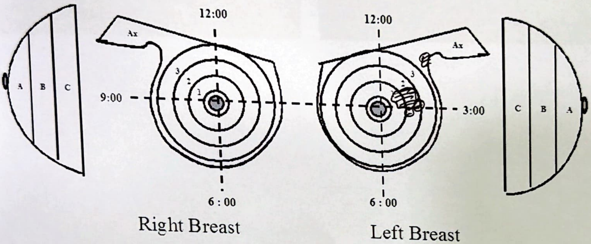
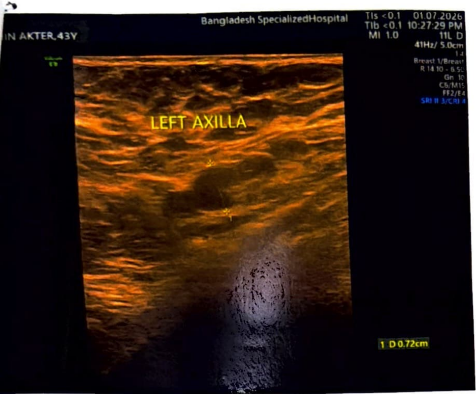
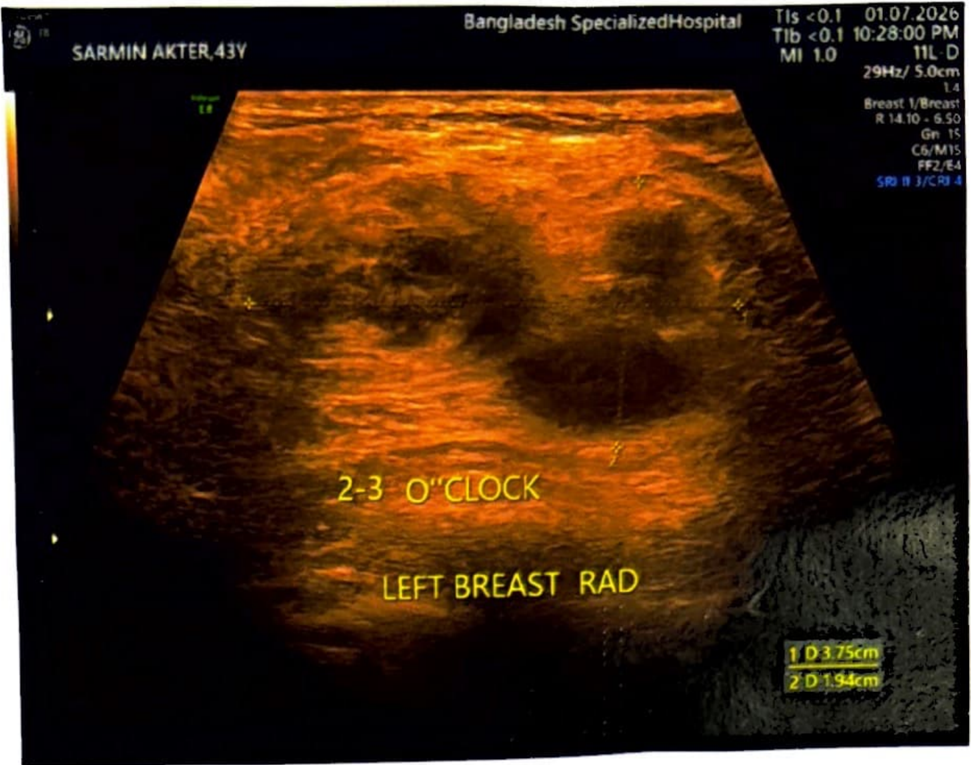

# Parsed documents
Docling output for 1 file(s), in date order. Each section below is one input document; all images live in `./assets`.

## Contents

- [usg of both breast 01.07.2026.pdf](#usg-of-both-breast-01072026pdf)

---

## usg of both breast 01.07.2026.pdf

(-laANGLADESH
~  ~ECIALIZED  HOSPITAL
beca11fe you are spec"f;
USG REPORT
Hospital No :  HI 2607658470  Invoice No : V26077 44489  1 .
Patient Name :  MST. SARMIN AKTER  nvorce Date: 01/07/2026
Age· 43  Final" d  D ize  ate: 01/07/2026 10·22
Ref. Doctor :  y 7M 10D  Gender. F  •  PM
Dr. Fcrdous Ara Begum MBBS, OCH  MD (Med' IO I • ' 1ca nco ogy)  A • , ssoc1ate Profmor(Rtd)  •
Test Name:  USG of Both Breast
L.M.P: June, 2026.
Family H/0 breast carcinoma: Nil.
Indication: Left breast lump
'
Comment:  ·······································
USG  finding  suggests  ·
Complex solid cystic mass (37.5 mm x  19.4 mm) with low suspicious for malignancy --at  2-3  o'clock position  In  left breast with  left axillary lymphadenopathy.
2, Normal  right breast with  normal right axillary lymph  node.
2T5hyamo/l Mir  OANGLAO[SJI SPECIALIZED HOSPITAl PLC,  txJ  ,alil.((/hOJµ,r, 1 /.,MI
■  ,  pu,  Road, Dhaka-1201i llongladesh, I  lot/lne: 10633, 09666700100  E·mall: bsll/.d/wkcri.n911wil.co11i Web:  www.  l/J<'C  -

BANGLADESH
SPECIALIZED HOSPITAL
because you are special
category:  BI-RADS-4a
Final  Assessment and  Recommendation:
LoW5USpicioUS for malignancy. Biopsy is recommended.
12:00  12.00
9.00
3.00
I
I
6: 00  6: 00
Right Breast  '-  Left Breast
lSA = Subareolar area, 1  =  Close to the nipple, 2  =  Half way out of nipple, 3  =  Lesion in the periphery, Ax = Axilla. A  =  Very superficial, B  =  Midway down the breast, C  =  Deep near the chest wall\ RAD =  Radial, AR =  Anti radial
Lt: 2-3:001-2 B-C 37.5 mm x  19.4 mm RAD
PROF. DR. SHA.R~  RUPA. M88S, IA.Phil, FCPS Dec>anment of Radiology & Imaging &angladesh Specialized Hospital Ltd. BMOC No : A-31094
2
·  ·  '  I  IANGlADESII SP£CIAUZ£D H
ncJ

:MIN AKTER,43Y  Exam Date: 01.07.2026 10:22:07 PM
Bangladesh SpeciallzedHospital  01,07 2026  Bangladesh SpecialzedHospital
- -·------
o
~  -..:.LEFrAxiLLA
.2-3  .o:'CCbCK
-  --..  ~~-
LEFT  BREAST  RAD
IO 11~m
10071cm  l  D •  'Mcm
Bangladesh SpecializedHospital
•  l  ,!,  I·•  ,1.•,.  •,4  182938026
RIGHT AXILLA
RIGHT BREAST
Page 1 of 1

