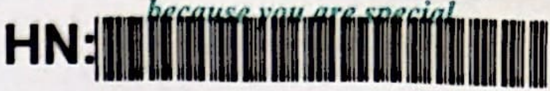
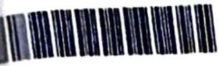
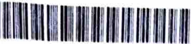

# Parsed documents
Docling output for 6 file(s), in date order. Each section below is one input document; all images live in `./assets`.

## Contents

- [fnac 28.06.2026.pdf](#fnac-28062026pdf)
- [blood reports 01.07.2026.pdf](#blood-reports-01072026pdf)
- [echo 01.07.2026.pdf](#echo-01072026pdf)
- [Histopathology 02.07.2026.pdf](#histopathology-02072026pdf)
- [CT chest including Liver 06.07.2026.pdf](#ct-chest-including-liver-06072026pdf)
- [immunohistochemistry 13.07.2026.pdf](#immunohistochemistry-13072026pdf)

---

## fnac 28.06.2026.pdf

..

~lfil~ \Sl~M~fz~ ~~ Ol%C4'1 Ji1t~01:;,

## Amin Diagnostic &amp; Medical Services

33/23/2, R.C.R.C Street, Amin Shaban, College More, Court Para, Kushtia

## FNAC REPORT

llllllllll 111111111111111111111

Patient ID

Invoice No

Patient Name

Age

Ref. Doctor

: H12606582760

Report No: 12606799161

: AD2606582491

Invoice Date: 27/06/2026 11 :52 AM

:  MRS. SHARMIN AKTER

: 44Y 1D

Gender: F

: PROF. DR. ASHRAF-UL-HAQUE DARA , FCPS, MS

Report Status: FINALIZED

Delivery Date : 30/06/2026

Lab No.

Test Name

: 12606741198

:FNAC

Collection Date :  28/06/2026 09:38 PM

Lab ID: C 1422/26

## Specimen:

Left  breast lump, 3 o'clock  position.

## Aspiration Note:

Blood mixed material came out on aspiration.

## Microscopic Examination:

Smears show large number of anaplastic epithelial cells arranged in  clusters,  in glandul\_ar  pattern,  in sheets and singly. These cells reveal moderate nuclear pleomorphism, large vesicular nuclei and coarsely ci11rnped chromatin. Background shows blood, necrotic debris and inflammatory cells. ,

## Comment:

Left breast lump, 3 o'clock  position (FNA): Positive for malignant cell.

Compatible with ductal carcinoma.

OR.IMT~D

MBBS, BCS (HEAL  TH~ M.Phll (PathologY) ASSOCIATE PROFESSOR &amp; HEAD DEPARTMENT OF PATHOLOGY KUSHTIA MEDICAL COLLEGE, KUSHTIA

~ llti'Pf  flt  'Q 1'1 I  llttflUI lltii~. ~ '11\"' ....  llttf1«1 ~,mi ....  ~.!.. (IN'"''"° llftw,.,, · 'P 1f't ,m;;,fl

Printed by: IMTlAZ  Printed Onie

: 28/06/2026 22:◄ 1 PM

Sol\wnre By:: Myaoft Unuted

..\_,

---

## blood reports 01.07.2026.pdf

,  :  1111  Ml  1111  lff 111111/H 1111111

## BIOCHEMISTRY REPORT

Invoice No

Patient Name

Age

Referred By

Requested test

:  V2607744491

Hospital No

:  H12607658470

:  MST. SARMIN AKTER

:  43Y 7M 1  OD

Gender

:  Female

:  Dr. Ferdous Ara Begum MBBS, OCH, MD (Medical Oncology) , Associate Professor(Rtd)

:  Creatinine Serum

LAB.No

: 12607924257

Sample Collected  :  01/07/26

05:06:58 PM

Sample Received  :  01/07/26 05:42:11 PM

Report Date

:  01/07/26 06:37 pm

Finalized Date

:  01/07/26 06:37 pm

Sample type

:  BLOOD

## Test is carried out by Vitros XT 7600

| Test       | Reference Value                                                              |
|------------|------------------------------------------------------------------------------|
| Creatinine | Adult: 0.6 - 1.3 mg/di, ................... Chil~: _ 0.3 _-_ 0. 7 mg/di __ _ |

l

I

I

·

I

■

■

■

■

2

3

1

----------------------------------------------------------------------------······-----------·······------

Vd DI (Electronlc Slgnature)

Ho I

Entered by  (S-,,,0,,lo llfndlff) RaJlb Kumar..,\_, ~dical  TechnOI091et LabOratory Medicine

Prepared by

: RAflQUt.1118

## DICI  P

---

Finalized by (Electronic Slgnature)

Page 1 of

Dr. Sanla Hossaln MBBS, BCS, MD (Laboratory Medicine) Consultant; Laboratory Mediclne Bangladesh Specialized Hospital PLC.

-- - -

: 1111111111111111

## BIOCHEMISTRY REPORT

Invoice No

:  V2607744489

Hospital No

:  H12607658470

LAB.No

: 12607924261

Patient Name

:  MST. SARMIN AKTER

Sample Collected  :  01/07/26 05:10:01 PM

Age

:  43Y 7M 10D

Gender

:  Female

Sample Received  : 01/07/26 05:41:51 PM

Referred By

:  Dr. Ferdous Ara Begum MBBS, OCH, MD (Medical Oncology) , Associate Professor(Rtd)

Report Date

:  01/07/26 07:25 pm

Finalized Date

:  01/07/26 07:25 pm

Requested test

:  Alkaline Phosphatase Serum (ALP)

Sample type

:  BLOOD

,--

J

---------- ----------------

| -­ Test              |        | ---Re-fe-re-nc_e_V-alue --~J   |
|----------------------|--------|--------------------------------|
| Alkaline Phosphatase | 55 U/L | 38 - 126 U/L                   |

L-

"

l

0

3

d  by (Electronic Signature) Entere Rajlb t&lt;umar sarker ,cal Technologitl ::0,atory Medicine

Dato

--- ----

## Test is carried out by Vitros XT 7600 J ~:=

verified by  (Electronic Signature) Dlpanker Panday

BSc In Laboratory Science (OU)

MSc In Microbiology (JnU)

Sr  Sclentific Officer, Laboratory Medicine

Bangladesh Speclallud Hospital PLC.

!Jt/07/1026 0710 30 PM

Finalized by (Electronic Signature) or. Sanla Houaln

MBBS, BCS, MD (\.lbot'ltocy Medicine) consultant.~  Mldk:lne

Bangladesh Speddnd HOJl)bl PLC Page

0epartmlf\t of Llborlt0'1 Medlclntt

i

of

7,

Shyornot/

,.\_.,,,\_  \_\_  ·- o- -

-

I

## IMMUNOLOGY REPORT

HN~lill-111111111

No :

Name :

V26077  44489

MST. SARMIN AKTER

• •

43Y 7M 100

Hospital No

: H12607658470

Gender

:  Female

red Sy

:  Dr. Ferdous Ara Begum MBBS, OCH, MD (Medical Oncology), Associate Professor(Rtd)

ested test

:  CA-15.3

LAB.No

:  12607924260

Sample Collected  :  01107/26 05:10:01 PM

Sample Received  : 01107126 05:41:53 PM

Report Date

: 01/07126 07:25 pm

Finalized Date

:  01/07126 07:25 pm\

Sample type :

BLOOD

## Test is carried out b Alinity i AMS

-----

Test

\_\_\_\_\_  c-- -

R~ I!\_

Serum CA 15-3

8.10U/m\

Reference Value

&lt;= 31.3 U/ml

...

Entered by (Electronic Signature) Rajib Kumar Sarker

c

~

Me,dlcal Technotog,et uboretory Medicine

Cl.Prepared by

: RJv=,ouLDB18

Verified by (Electronic Signature) Dlpanker Panday

Dato

BSc In Laboratory Science (DU) MSc In Mrcrob,ology (JnU) Sr. Scientific Officer, Laboratory Medicine Bangladesh Specialized Hoapltal PLC. t,110712026 0120 o◄ PM

BANGLAOtSH SPECIALIZED HOSPITAL PLC.

Final/zed by (Electronic Signature) Or. Santa Hossain

MBBS, BCS, MD (LabofatOJY Medlcme) Consultant, Laboratory Medldne Oeportmen\ of LabOrator, Medlt1ne Bangladesh Speclal\zad Hoap,ta\ PLC

Page 1 of'

---

## echo 01.07.2026.pdf

!

~

5

·

## CARDIOLOGY REPORT

because you

are

.special

Hospital No :

H12607658470

Invoice No : V2607744489

Invoice Date : 01/07/2026

Finalized Date:

01/07/2026 05:56 PM

Patient Name :  MST. SARMIN AKTER

Age : 43Y 7M 100

Gender: F

Ref.  Doctor :

Dr. Ferdous Ara Begum MBBS, OCH, MD (Medical Oncology), Associate Professor(Rtd)

Patient Name :  MST. SARMIN AKTER

Age : 43Y 7M 100

Gender: F

Ref.  Doctor :

Dr. Ferdous Ara Begum MBBS, OCH, MD (Medical Oncology), Associate Professor(Rtd)

Test Name :

Echo Cardiography+Color Doppler

## MEASUREMENT 2D:

AO

32 mm

LVIDD

45mm

RVID

LA

31  mm

LVIDS

31  mm

RVOT

IVSD

11  mm

FS

32 %

PA

PWD

10 mm

EF

60 %

TAPSE

## Dom~h:r m~a~Yc~ment~:

Velocities

Peak

Mean

parameters

Gradients

Gradients

MV

1.0

mis

4.0 mmHg

mmHg

AV

1.3

mis

7.0 mmHg

mmHg

TV

0.6

mis

1.0 mmHg

mmHg

PV

1.1  m/s

5.0 mmHg

mmHg

PASP

mmHg

PADP

mmHg

## DESCRIPTION:

## Chamber:

LA

: Normal

LV

: Normal in dimension and wall motion.

RA

: Normal

RV

: Normal

Valves:

MV

: Normal

AV

: Normal.

PV

: Normal.

TV

: Normal.

IAS

: Intact.

IVS

: Intact.

Pericardium:

No pericardia! effusion.

Thrombus/Vegetation other mass: Not seen.

## IMP~SION:

17 mm

Regurgitation

MR-Nil

AR-Nil

TR-Nil

PR-Nil

MVA

MV-Annulus

AV-ring

ACS

18 mm

Others

MVA (P 1 /2T)

Ela Ratio

1.3

OT

E/E 1

PFR

12

- r- ~o regional wall motion abnormality at rest.

- /2ood LV &amp; RV systolic function (LVEF-60%).

~

/

Normal

cardiac chamber dimensions.

- ~ormal valve morphology.

,

•/No

Thrombus/vegetation or

porlcardlal

effusion seen.

Prc:p/4o By

A£m&amp;Akte,

Or. Mohamm:m;:n Tanvoer MBBS (O~IC), MD (Curdlology), FESC Ca,u1olo91s1 &amp;  Medicine Speciallsr ASb0Cl818 Profctssor (Card1olo9y), NICVD Sonlor Consultant, Bilngladesh Specialized Hospital PLC.

---

## Histopathology 02.07.2026.pdf

v:  1111\11111n11111u11111~ 11111

## H1sroPArH0LoGv RePoRr  HN:

n1I111111lr1u.1n1rt

Invoice No

Hospital No :

Patient Name

Age/ Gender

Ref. Doctor

:

V 2 607744488

Invoice Date:

01/07/2026 04:57 PM

Delivery Date:

04/07/2026

H 12 607658470

Report No

:

126000876842

Report Status:

FINALIZED

:

MST. SARMIN AKTER

:

43Y 7M 130 / Female

Patient Status:

OPD

: Dr. Ferdous Ara Begum MBBS, OCH, MD (Medical Oncology) , Associate Professor(Rtd)

: TISSUE

Lab No  :

12607925145

: Hlstopathology (1)

Sample

Test Name

Coll. Date

: 02/07/2026 07:20 AM

Rev. Date  :

02/07/2026 07:21 AM

Report Date  :

04/07/2026 05:24 PM

Lab No: H- 3137 /26

Thank  you very  much for  this kind  referral

USG Findings :

Complex solid cystic mass with low suspicious for malignancy at 2-3 O' clock

position In left breast.

Specimen :

Left breast lump at 2-3 O' clock position (Core biopsy).

## Gross Findings:

Specimen is received in formalin, labeled with name, number and is designated as wleft breast lump at 2-3 O'clock position". It consists of five unoriented tan-white tissues, largest one measures 1.2 x 0.3 x 0.2cm. All embedded in a block (ax; A 1 ).

## Microscopic Features:

Sectjons  made  from  submitted  core  biopsy  show  breast  tissue.  These  sheets,  clusters  and  few  tubules  of anaplastic duct epithelial  cells. These  have enlarged  pleomorphic hyperchromatic nuclei,  some have  prominent nucleoli. Few lymphocytic infiltrations are present.

DCIS and atypical ductal hyperplasia are not seen.

Occasional mitosis are present. No necrosis is identified.

No hemorrhage and calcification are identified.

In some foci, these reveal lobular like infiltration.

No lymph-vascular space invasions are present.

## DIAGNOSIS:

Left breast lump at 2-3 O' clock position; Core biopsy:

- -Suggestive of lnflltratlng duct cell carcinoma, NST; Grade II. (See description please).

Clinlcopathologlcal, radlo/oglcal  correlatlon and  lmmunohlstochemistry  is recommended  for  further evaluation and confirmation.

N\

Prof. Dr.  Maslw\1 PdrvtU

MBBS (0,ll 1 11.ll 1  I  .,:1  ,,lv,.JY)

St1111,11  \  ""~· ,l  "

l

.ill,. ,1,1\)1:.l

l lq ,111111, 1  .

,

,l

.JllltY Mel.llCll'll

HJ11~

1

1.i,1.,,1,  .,, ,,,  ,.111 .  .iJ

Hospltol PLC

Sotlwt1~ By

Mysof\ Llm1led

Printed by RAFIQUL.,6818 P1l11t.od Ot1tu. 04/0m026 17 23 PM

Pi.100  1 of 1

---

## CT chest including Liver 06.07.2026.pdf

.

het:au,;r }'"" are ,;pecia/

| ID No        | .   | V2607744489                       | DATE   | . . 06/07/2026   |
|--------------|-----|-----------------------------------|--------|------------------|
| PATIENT NAME | . . | MST. SARMIN AKTER                 | SEX    | FEMALE .         |
| PART OF EXAM | :   | CT CHEST INCLUDING LIVER.         | AGE    | : : 43 YEARS.    |
| REF. BY      | :   | ASST.PROF. DR. FERDOUS ARA BEGUM, | MBBS.  | OCH.MD           |

Left breast lump.

None.

C1inica1  Information

H/0  previous surgery

Technique

Contrast  study

Comparison

Volume  axia1  scan of Chest with liver  was done.

Pre  and  post.

None.

## CT SCAN  OF CHEST INCLUDING  LIVER

| Observations: LUNGS AND LARGE AIRWAYS   | :   | No focal abnormality is noted in both lungs.                                                                                                        |
|-----------------------------------------|-----|-----------------------------------------------------------------------------------------------------------------------------------------------------|
| MEDIASTINUM AND HILA                    | :   | abnormality is noted in the mediastinum. No or mass J.esion                                                                                         |
| PLEURA                                  | :   | No pleural effusion is noted on either side.                                                                                                        |
| CHEST WALL AND LOWER NECK               | :   | • IJ.J.-defined mass (27 X 19) mm in upper and outer quadrant of left breast. No chest wall invasion is noted. • Norm.al. axi11ary 1ymphadenopathy. |
| HEART AND VESSELS                       | :   | Heart and great vessels norma1. are                                                                                                                 |
| LIVER                                   | :   | Nil. significant.                                                                                                                                   |
| GALL BLADDER                            | :   | Nil. significant.                                                                                                                                   |
| BILIARY TREES                           | :   | Nil. significant.                                                                                                                                   |
| SPLEEN                                  | :   | Ni1 significant.                                                                                                                                    |
| PANCREAS                                | :   | Nil. significant.                                                                                                                                   |
| LYMPHADENOPATHY OR ASCITES              | :   | No paraaortic J.ymphadenopathy or ascites.                                                                                                          |
| OTHER FINDINGS                          | :   | None.                                                                                                                                               |

## . Impression  and  recommendations:

## CT  scan  suggests:

- Q Hi.gh1y suspicious  ma1ignant  lesion (27 x 19) mm at  upper  and  outer quadrant  of  1eft breast.  No  chest  wall  invasion  is  noted.
- Q Normal.  both  l.ungs.
- ~ No  mediasti.na1  or  axil1ary  lymphadenopathy.
- c::;&gt; No  focal  l.esi.on  in  liver.

~

DR. SHARMIN  AKHTAR  RUPA

i-:lfjBS, M. Phil, Fr"PS Pro!e53or ,,adJology (,, Jrrw9Jn9 Popul~r  MndicaJ Colleg~ &amp; HOBpJld]

Consultant-Bangladeah  Specialized Hospital

Tran,crLptiild  by:  R.l.~v~

---

## immunohistochemistry 13.07.2026.pdf

V: 11111111111 ll llllllll  H 1111

Invoice No

Hospital No

Patient Name

Age/ Gender

Ref. Doctor

: V2607745318

Invoice Date:

02/07/2026 03:26 PM

Delivery Date : 12/07/2026

Report Status: FINALIZED

: H12607658470

Report No

: 126000891993

:

MST. SARMIN AKTER

: 43Y 7M 22D / Female

Patient Status: OPD : Dr. Ferdous Ara Begum MBBS, OCH, MD (Medlcal Oncology) , Associate Professor(Rtd)

Sample

Test Name

Coll. Date

: TISSUE

: lmmunohistochemlstry-4

: 13107/2026 07:47 PM

Lab No: H- 3137/26

Lab No  : 12607943167

Report Date  : 13/07/2026 08:18 PM

Thank  you ve,y  much for  this kind  refen-al

Specimen

: Left breast lump at  2-3 O'clock  position (Core biopsy).

Previous diagnosis

: Suggestive of infiltrating duct cell carcinoma, NST; Grade II.

Estrogen Receptor (Dako pharmDx)

: None of  the tumor cell nuclel are reactive for ER. Score: (0+0)/8

Progesterone

Receptor (Dako phannDx) : None of  the tumor cell nuclei are reactive for PR. Score: (0+0)/8

HER2neu{Dako Hercep test)

: No staining ls observed or membrane staining is seen.

Conclusion :

ER -

PR -

HER2neu -

Ki-67

Negative, score 0/8

Negative, score 0/8

Negative, score 0

## lmmunohlstochemlstry Report  HN: 1111 ■11~r11■1r rr'

-75% proliferative Index

## The specimen was fixed in formalin for 6-48 hours.

Note: Paraffin sections of the formalin  fixed tissues are stained for Estrogen receptor using DAKO Rl5084, Progesterone DAKO R15084, HER2neu RA0485. For estrogen and progesterone receptor study, a result is considered positive if  at least 1% of  the lesional cells display any intensity of  unequivocal nuclear staining. Allred Scoring System for ER &amp; PR -

## Score for proportion staining

| 0   | No cells positive         | 0 staining   | Score for intensity Negative   |
|-----|---------------------------|--------------|--------------------------------|
| l   | <l % cells positive       | 1            |                                |
| 2   | 1-10% cells positive      | 2            | Weak                           |
| 3   | 11-33% cells positive     | 3            | Intermediate                   |
| 4   | 34-66% cells positive     |              | Strong                         |
| 5   | 61 • l 00% cells positive |              |                                |

\/:  n\ 1\1 \111\1\I \\  1\\1111\1 \\  I 1\1 lmmunohlstochemlstry Report  HN: 111111111mirfll\lll(f ffllr'

\nvoice No :

Hospital No :

Patient Name :

~el  Gender :

Ref. Doctor

V2607745318

Invoice Date:

02/07/2026 03:26 PM

Delivery Date:

12/07/2026

H12607658470

Report No

: 126000891993

Report Status:

FINALIZED

MST. SARMIN AKTER

43Y 7M 120 I Female

Patient Status:

OPD

: Dr. Ferdous Ara Begum MBBS, OCH, MD (Medical Oncology), Associate Professor(Rtd)

Samp\e

Test Name

Coll. Date

: TISSUE

: lmmunohlstochemlstry-4

: 13/07/2026 07:47 PM

Lab No  : 12607943167

Report Date  : 13/07/2026 08:18 PM

## For HER2 0 ea' following guideline is employed.

| Staining pattern                                                                                                                                     | Score   | BERl neu protein overexpression assessment   |
|------------------------------------------------------------------------------------------------------------------------------------------------------|---------|----------------------------------------------|
| No staining is observed or membrane staining is observed in less than 10% of the tumour cells.                                                       | 0       | Negative                                     |
| A faint/barely perceptible membrane staining is detected in more than 10% of the tumour cells. The cells are only stained in part of their membrane. | 1+      | Negative                                     |
| A weak to moderate complete membrane staining is observed in more than 10% of the tumour cells.                                                      | 2+      | Weakly positive equivocal                    |
| A strong complete membrane staining is observed in more than 10% of the tumour cells.                                                                | 3+      | Strongly positive                            |

lmmunohistochemistry  is  perfonned  by  automation using VENTANA BenchMark GX  system.

'

~

Prof. Or. M•

MBBS(CMC~
