# Parsed documents
Docling output for 10 file(s), in date order. Each section below is one input document; all images live in `./assets`.

## Contents

- [usg both breasts 27.06.2026.pdf](#usg-both-breasts-27062026pdf)
- [fnac 28.06.2026.pdf](#fnac-28062026pdf)
- [blood reports 01.07.2026.pdf](#blood-reports-01072026pdf)
- [echo 01.07.2026.pdf](#echo-01072026pdf)
- [usg of both breast 01.07.2026.pdf](#usg-of-both-breast-01072026pdf)
- [usg of both breast 01.07.2026.pdf](#usg-of-both-breast-01072026pdf)
- [USG of Whole Abdomen 01.07.2026.pdf](#usg-of-whole-abdomen-01072026pdf)
- [Histopathology 02.07.2026.pdf](#histopathology-02072026pdf)
- [CT chest including Liver 06.07.2026.pdf](#ct-chest-including-liver-06072026pdf)
- [immunohistochemistry 13.07.2026.pdf](#immunohistochemistry-13072026pdf)

---

## usg both breasts 27.06.2026.pdf

~lfitrl \Sl~t Amin  Diagn  . A . Bhaban  ColJege More, Court Para, Kusht1a
3  3  1  3120  IIIIIIIIIIII  Ill llHIIIIMlll  11
j6&  •llllll  ll  l  l~  R.C.R.C Slre~~G nu:EPOR;
Report Status: FINALIZED
1111111I  1111111I  fllll  1111111~1  __  Report No : 12606306884  Delivery Date : 27/06/2026
: H  12606582760  Invoice Date: 27/06/2026 11 :52 AM
patient ID :  AD2606582491
Invoice No  :  MRS. SHARMIN AKTER
patient Name  Gender: F
Age  : 44y : PROF. DR. ASHRAF-UL-HAQUE DARA , FCPS, MS
Ref.  Doctor
: USG OF BOTH BREASTS  - --  -  ------ -----
[!~s~na_m_e
RIGHT BREAST  : Rt. Breast showing homogeneous tissues texture.No significant solid or  cystic lesion is seen .Ducts are not found dilated.Nipple and areola appears normal .
·
LEFT BREAST  Lt.  Breast showing homogeneous tissues texture.Ill defined hypoechoic mass area noted into the outer quadrant at 03 ' 0 'clock position measuring ( about 2.6 x 1.8 cm ) with internal vascularity . Ducts are mildly found  dilated. Nipple and areola appears normal .
IMPRESSION  : Ill defined hypoechoic mass in left breast possibly malignant ( Bl-RADS - 5 ).
SONIA SHARMIN LINA  DR. S  DR. S  KUMAR PAUL  KUMAR PAUL
MBBS. DMU (D ka). PGT (Radiology & Imaging) Trained on Vascular Doppler RDMS(USA).
-  ::  Mysoft  Limited
-~---  Printed by:  LIN  Printedo  ---- ------------------:::--: Software By
A  -ate: 27/06/2026 13:28 PM  Page 1 of 1
(9 01712243514 ,  01972243514  ,a.  amindiagnostic.com.bd  S  amindiagnostic.kst@gmaH.com
-- -  .,

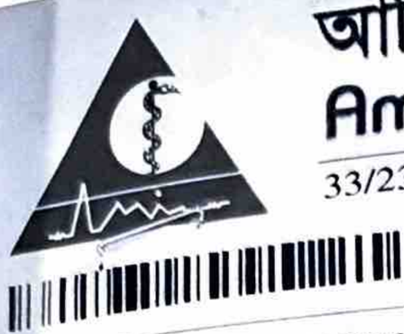

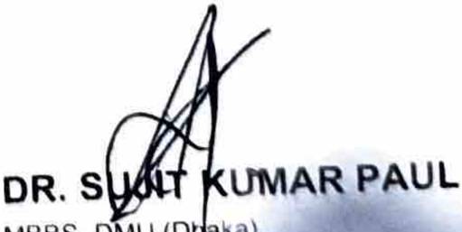

---

## fnac 28.06.2026.pdf

~lfil~ \Sl~M~fz~ ~~ Ol%C4'1 Ji1t~01:;,
Amin Diagnostic & Medical Services
33/23/2, R.C.R.C Street, Amin Shaban, College More, Court Para, Kushtia
Ill lllf lllllllllllllllllllR  FNAC REPORT  llllllllll 111111111111111111111
Patient ID  : H12606582760  Report No: 12606799161  Report Status: FINALIZED
Invoice No  : AD2606582491  Invoice Date: 27/06/2026 11 :52 AM  Delivery Date : 30/06/2026
Patient Name  :  MRS. SHARMIN AKTER
Age  : 44Y 1D  Gender: F
Ref. Doctor  : PROF. DR. ASHRAF-UL-HAQUE DARA , FCPS, MS
Lab No.  : 12606741198  Collection Date :  28/06/2026 09:38 PM
Test Name  :FNAC
Lab ID: C 1422/26
Specimen:
Left  breast lump, 3 o'clock  position.
..  Aspiration Note:
Blood mixed material came out on aspiration.
Microscopic Examination:
Smears show large number of anaplastic epithelial cells arranged in  clusters,  in glandul_ar  pattern,  in sheets and singly. These cells reveal moderate nuclear pleomorphism, large vesicular nuclei and coarsely ci11rnped chromatin. Background shows blood, necrotic debris and inflammatory cells. ,
Comment:
Left breast lump, 3 o'clock  position (FNA): Positive for malignant cell.
Compatible with ductal carcinoma.
OR.IMT~D  OR.IMT~D
MBBS, BCS (HEAL  TH~ M.Phll (PathologY) ASSOCIATE PROFESSOR & HEAD DEPARTMENT OF PATHOLOGY KUSHTIA MEDICAL COLLEGE, KUSHTIA
~ llti'Pf  flt  'Q 1'1 I  llttflUI lltii~. ~ '11\"' ....  llttf1«1 ~,mi ....  ~.!.. (IN'"''"° llftw,.,, · 'P 1f't ,m;;,fl  Sol\wnre By:: Myaoft Unuted
Printed by: IMTlAZ  Printed Onie  : 28/06/2026 22:◄ 1 PM  Paga 1 ol 1
C9 0122243514, 01972243514  ®J)  h l un1indiagn0Slic.coau.  c.  --- - ---~~~~:::.~-----·tic kst  (ri) c.nu1i.l.cu1n ~ urn i n '--"  u g 11  l..,  :-. · · ~
.._,

---

## blood reports 01.07.2026.pdf

BANGLADESH
S  SPECIALIZED HOSPITAL
,  :  1111  Ml  1111  lff 111111/H 1111111  BIOCHEMISTRY REPORT  HN ~1r11·11111n111
Invoice No  :  V2607744491  Hospital No  :  H12607658470  LAB.No  : 12607924257
Patient Name  :  MST. SARMIN AKTER  Sample Collected  :  01/07/26  05:06:58 PM
Age  :  43Y 7M 1  OD  Gender  :  Female  Sample Received  :  01/07/26 05:42:11 PM
Referred By  Report Date  :  01/07/26 06:37 pm
:  Dr. Ferdous Ara Begum MBBS, OCH, MD (Medical Oncology) , Associate Professor(Rtd)  Finalized Date  :  01/07/26 06:37 pm
Requested test  :  Creatinine Serum  Sample type  :  BLOOD
Test is carried out by Vitros XT 7600
----------------------------------------------------------------------------······-----------·······------  ---
l
I
I
·  I
■
■
■
■
2
3
1
Finalized by (Electronic Slgnature)
Entered by  (S-,,,0,,lo llfndlff) RaJlb Kumar..,_, ~dical  TechnOI091et LabOratory Medicine  Vd DI (Electronlc Slgnature)
Ho I  Dr. Sanla Hossaln MBBS, BCS, MD (Laboratory Medicine) Consultant; Laboratory Mediclne Bangladesh Specialized Hospital PLC.
Page 1 of
Prepared by  : RAflQUt.1118  DICI  P
21 Shyamoll, Mlrpur  Roact Dhako-r207, llangladah, Hq#t,c-:

BANGLADESH
S  SPECIALIZED HOSPITAL
: 1111111111111111  BIOCHEMISTRY REPORT  HN ~llilll 1 I If 18111
-- - -  --- ----
Invoice No  :  V2607744489  Hospital No  :  H12607658470  LAB.No  : 12607924261
Patient Name  :  MST. SARMIN AKTER  Sample Collected  :  01/07/26 05:10:01 PM
Age  :  43Y 7M 10D  Gender  :  Female  Sample Received  : 01/07/26 05:41:51 PM
Referred By
:  Dr. Ferdous Ara Begum MBBS, OCH, MD (Medical Oncology) , Associate Professor(Rtd)  Report Date  :  01/07/26 07:25 pm
Finalized Date  :  01/07/26 07:25 pm
Requested test  :  Alkaline Phosphatase Serum (ALP)
Sample type  :  BLOOD  J
---------- ----------------
,--  L-  Test is carried out by Vitros XT 7600 J ~:=
"
0
l
3
verified by  (Electronic Signature) Dlpanker Panday  Finalized by (Electronic Signature) or. Sanla Houaln
BSc In Laboratory Science (OU)  MBBS, BCS, MD (\.lbot'ltocy Medicine) consultant.~  Mldk:lne
d  by (Electronic Signature) Entere Rajlb t<umar sarker ,cal Technologitl ::0,atory Medicine  MSc In Microbiology (JnU)  0epartmlf\t of Llborlt0'1 Medlclntt
Sr  Sclentific Officer, Laboratory Medicine
Bangladesh Speclallud Hospital PLC.  Bangladesh Speddnd HOJl)bl PLC Page  i  of  I
Dato  !Jt/07/1026 0710 30 PM
7,  Shyornot/  ,._.,,,_  __  ·- o- -  -

BANGLADESH
S  SPECIALIZED HOSPITAL
llllllll\\  IMMUNOLOGY REPORT  HN~lill-111111111
Hospital No  : H12607658470  LAB.No  :  12607924260
No :  V26077  44489
MST. SARMIN AKTER  Sample Collected  :  01107/26 05:10:01 PM
Name :
43Y 7M 100  Gender  :  Female  Sample Received  : 01107126 05:41:53 PM
• •  Report Date  : 01/07126 07:25 pm
red Sy  :  01/07126 07:25 pm\
:  Dr. Ferdous Ara Begum MBBS, OCH, MD (Medical Oncology), Associate Professor(Rtd)  Finalized Date
ested test  :  CA-15.3  Sample type :  BLOOD
Test is carried out b Alinity i AMS
-----  Reference Value
Test  _____  c-- -  R~ I!_
<= 31.3 U/ml
8.10U/m\
Serum CA 15-3
Verified by (Electronic Signature) Dlpanker Panday  Final/zed by (Electronic Signature) Or. Santa Hossain
...  Entered by (Electronic Signature) Rajib Kumar Sarker
c
~  Me,dlcal Technotog,et uboretory Medicine  MBBS, BCS, MD (LabofatOJY Medlcme) Consultant, Laboratory Medldne Oeportmen\ of LabOrator, Medlt1ne Bangladesh Speclal\zad Hoap,ta\ PLC
Dato  BSc In Laboratory Science (DU) MSc In Mrcrob,ology (JnU) Sr. Scientific Officer, Laboratory Medicine Bangladesh Specialized Hoapltal PLC. t,110712026 0120 o◄ PM  Page 1 of'
Cl.Prepared by  : RJv=,ouLDB18
2, ~hyamoll. Mlrrmr  Rood, Dhaka-1201. Banolade.,/1, Hollln~ ,c)6)~09666700 f OQ E·moll: bshldhal<009mall.corn, Web; www.bdsp«tal1Jfdlw1prt0Lcom  BANGLAOtSH SPECIALIZED HOSPITAL PLC.

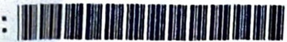

---

## echo 01.07.2026.pdf

BANGLADESH
SPECIALIZED HOSPITAL
because you  are  .special
11~u111~11111~mm111i~111~1~  CARDIOLOGY REPORT  111111111111111
Hospital No :  H12607658470  Invoice No : V2607744489  Invoice Date : 01/07/2026  Finalized Date:  01/07/2026 05:56 PM
Patient Name :  MST. SARMIN AKTER  Patient Name :  MST. SARMIN AKTER  Age : 43Y 7M 100  Age : 43Y 7M 100  Gender: F  Gender: F
Ref.  Doctor :  Ref.  Doctor :  Dr. Ferdous Ara Begum MBBS, OCH, MD (Medical Oncology), Associate Professor(Rtd)  Dr. Ferdous Ara Begum MBBS, OCH, MD (Medical Oncology), Associate Professor(Rtd)
Test Name :  Echo Cardiography+Color Doppler
MEASUREMENT 2D:
AO  32 mm  LVIDD  45mm  RVID  MVA
LA  31  mm  LVIDS  31  mm  RVOT  MV-Annulus
IVSD  11  mm  FS  32 %  PA  AV-ring
PWD  10 mm  EF  60 %  TAPSE  17 mm  ACS  18 mm
Dom~h:r m~a~Yc~ment~:
Peak  Mean
parameters  Velocities  Regurgitation  Others
Gradients  Gradients
MV  1.0  mis  4.0 mmHg  mmHg  MR-Nil  MVA (P 1 /2T)
AV  1.3  mis  7.0 mmHg  mmHg  AR-Nil  Ela Ratio  1.3
TV  0.6  mis  1.0 mmHg  mmHg  TR-Nil  OT
PV  1.1  m/s  5.0 mmHg  mmHg  PR-Nil  E/E 1  12
PASP  mmHg  PADP  mmHg  PFR
DESCRIPTION:
Chamber:
LA  : Normal
!  LV  : Normal in dimension and wall motion.
RA  : Normal
RV  : Normal
Valves:
MV  : Normal
AV  : Normal.
PV  : Normal.
TV  : Normal.
IAS  : Intact.
IVS  : Intact.
Pericardium:  No pericardia! effusion.
Thrombus/Vegetation other mass: Not seen.
IMP~SION:
r- ~o regional wall motion abnormality at rest.
~  /2ood LV & RV systolic function (LVEF-60%).  ~
5  /  Normal  cardiac chamber dimensions.
·  ~ormal valve morphology.
,  •/No  Thrombus/vegetation or  porlcardlal  effusion seen.
Prc:p/4o By
A£m&Akte,  Or. Mohamm:m;:n Tanvoer MBBS (O~IC), MD (Curdlology), FESC Ca,u1olo91s1 &  Medicine Speciallsr ASb0Cl818 Profctssor (Card1olo9y), NICVD Sonlor Consultant, Bilngladesh Specialized Hospital PLC.
BANGI AOESII SPECIALIZED HOSPITAL PLC.
i 1 Shyomo/1, Mlmur Rood, (J1Ja41  1)01, IJanglodl!s/i, l{otllm:  /()t,J 1, 096067001 ()(~  t  mall bshJ,tlhC1Aa,d'gma/l,com, Wc>b.· www.bdspeciallredhospitolcom

---

## usg of both breast 01.07.2026.pdf

(-laANGLADESH
~  ~ECIALIZED  HOSPITAL
beca11fe you are spec"f;
USG REPORT
Hospital No :  HI 2607658470  Invoice No : V26077 44489  1 .
Patient Name :  MST. SARMIN AKTER  nvorce Date: 01/07/2026
Age· 43  Final" d  D ize  ate: 01/07/2026 10·22
Ref. Doctor :  y 7M 10D  Gender. F  •  PM
Dr. Fcrdous Ara Begum MBBS, OCH  MD (Med' IO I • ' 1ca nco ogy)  A • , ssoc1ate Profmor(Rtd)  •
Test Name:  USG of Both Breast
L.M.P: June, 2026.
Family H/0 breast carcinoma: Nil.
Indication: Left breast lump
'
Comment:  ·······································
USG  finding  suggests  ·
Complex solid cystic mass (37.5 mm x  19.4 mm) with low suspicious for malignancy --at  2-3  o'clock position  In  left breast with  left axillary lymphadenopathy.
2, Normal  right breast with  normal right axillary lymph  node.
2T5hyamo/l Mir  OANGLAO[SJI SPECIALIZED HOSPITAl PLC,  txJ  ,alil.((/hOJµ,r, 1 /.,MI
■  ,  pu,  Road, Dhaka-1201i llongladesh, I  lot/lne: 10633, 09666700100  E·mall: bsll/.d/wkcri.n911wil.co11i Web:  www.  l/J<'C  -

BANGLADESH
SPECIALIZED HOSPITAL
because you are special
category:  BI-RADS-4a
Final  Assessment and  Recommendation:
LoW5USpicioUS for malignancy. Biopsy is recommended.
12:00  12.00
9.00
3.00
I
I
6: 00  6: 00
Right Breast  '-  Left Breast
lSA = Subareolar area, 1  =  Close to the nipple, 2  =  Half way out of nipple, 3  =  Lesion in the periphery, Ax = Axilla. A  =  Very superficial, B  =  Midway down the breast, C  =  Deep near the chest wall\ RAD =  Radial, AR =  Anti radial
Lt: 2-3:001-2 B-C 37.5 mm x  19.4 mm RAD
PROF. DR. SHA.R~  RUPA. M88S, IA.Phil, FCPS Dec>anment of Radiology & Imaging &angladesh Specialized Hospital Ltd. BMOC No : A-31094
2
·  ·  '  I  IANGlADESII SP£CIAUZ£D H
ncJ

:MIN AKTER,43Y  Exam Date: 01.07.2026 10:22:07 PM
Bangladesh SpeciallzedHospital  01,07 2026  Bangladesh SpecialzedHospital
- -·------
o
~  -..:.LEFrAxiLLA
.2-3  .o:'CCbCK
-  --..  ~~-
LEFT  BREAST  RAD
IO 11~m
10071cm  l  D •  'Mcm
Bangladesh SpecializedHospital
•  l  ,!,  I·•  ,1.•,.  •,4  182938026
RIGHT AXILLA
RIGHT BREAST
Page 1 of 1

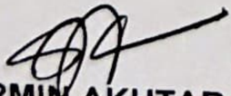

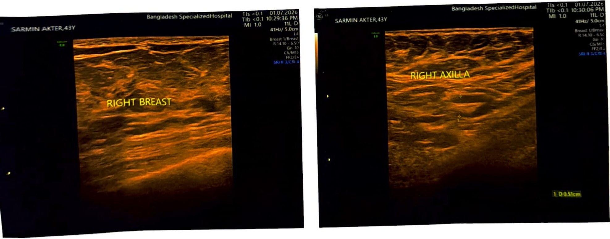

---

## usg of both breast 01.07.2026.pdf

(-laANGLADESH
~  ~ECIALIZED  HOSPITAL
beca11fe you are spec"f;
USG REPORT
Hospital No :  HI 2607658470  Invoice No : V26077 44489  1 .
Patient Name :  MST. SARMIN AKTER  nvorce Date: 01/07/2026
Age· 43  Final" d  D ize  ate: 01/07/2026 10·22
Ref. Doctor :  y 7M 10D  Gender. F  •  PM
Dr. Fcrdous Ara Begum MBBS, OCH  MD (Med' IO I • ' 1ca nco ogy)  A • , ssoc1ate Profmor(Rtd)  •
Test Name:  USG of Both Breast
L.M.P: June, 2026.
Family H/0 breast carcinoma: Nil.
Indication: Left breast lump
'
Comment:  ·······································
USG  finding  suggests  ·
Complex solid cystic mass (37.5 mm x  19.4 mm) with low suspicious for malignancy --at  2-3  o'clock position  In  left breast with  left axillary lymphadenopathy.
2, Normal  right breast with  normal right axillary lymph  node.
2T5hyamo/l Mir  OANGLAO[SJI SPECIALIZED HOSPITAl PLC,  txJ  ,alil.((/hOJµ,r, 1 /.,MI
■  ,  pu,  Road, Dhaka-1201i llongladesh, I  lot/lne: 10633, 09666700100  E·mall: bsll/.d/wkcri.n911wil.co11i Web:  www.  l/J<'C  -

BANGLADESH
SPECIALIZED HOSPITAL
because you are special
category:  BI-RADS-4a
Final  Assessment and  Recommendation:
LoW5USpicioUS for malignancy. Biopsy is recommended.
12:00  12.00
9.00
3.00
I
I
6: 00  6: 00
Right Breast  '-  Left Breast
lSA = Subareolar area, 1  =  Close to the nipple, 2  =  Half way out of nipple, 3  =  Lesion in the periphery, Ax = Axilla. A  =  Very superficial, B  =  Midway down the breast, C  =  Deep near the chest wall\ RAD =  Radial, AR =  Anti radial
Lt: 2-3:001-2 B-C 37.5 mm x  19.4 mm RAD
PROF. DR. SHA.R~  RUPA. M88S, IA.Phil, FCPS Dec>anment of Radiology & Imaging &angladesh Specialized Hospital Ltd. BMOC No : A-31094
2
·  ·  '  I  IANGlADESII SP£CIAUZ£D H
ncJ

:MIN AKTER,43Y  Exam Date: 01.07.2026 10:22:07 PM
Bangladesh SpeciallzedHospital  01,07 2026  Bangladesh SpecialzedHospital
- -·------
o
~  -..:.LEFrAxiLLA
.2-3  .o:'CCbCK
-  --..  ~~-
LEFT  BREAST  RAD
IO 11~m
10071cm  l  D •  'Mcm
Bangladesh SpecializedHospital
•  l  ,!,  I·•  ,1.•,.  •,4  182938026
RIGHT AXILLA
RIGHT BREAST
Page 1 of 1

---

## USG of Whole Abdomen 01.07.2026.pdf

BANGLADESH
SPECIALIZED HOSPITAL
because you are special
USG REPORT
lospital  No:  H12607658470  Invoice No: V2607744489  Invoice Date:  01/07/2026  Finalized Date:  01/07/202610:21 PM
•atient  Name:  MST. SARMIN AKTER  Age:  43Y 7M 100  Gender:  F
tef.  Doctor :  Dr. Ferdous Ara Begum MBBS, OCH,  MD (Medical Oncology) , Associate Professor(Rtd)
·est Name :  USG of Whole Abdomen 2D
L.M.P:  June, 2026.
Indication:  Screening.
HEPATO BILIARY SYSTEM
Liver  Normal (size -131 mm).
Gall Bladder  Normal.
Biliary tree  Normal.
Pancreas  Normal.
Spleen  Normal (size- 77 mm).
RENAL SYSTEM (KUB)
Kidneys:
Measurement  (RK= 111 mm, LK= 116 mm).
Cortico-sinusal differentiation  Maintained.
Cortical echogenicity  Not increased.
Parenchymal thickness  (RK- 13 mm, LK- 14 mm).
P-C systems  Not dilated.
Stone or focal lesion  Could not detected.
Urinary bladder :  Normal.
BANGLADESH SPECIALIZED HOSPITAL PLC. . ecia/izedhospita/.com 2/Shyamoli, Mirpur  Road, Ohaka-1207, Bangladesh, Hotline: 10633,09666700100, E-mail: bshl.dhaka@gmail.com, Web. www.bdsp

BANGLADESH
SPECIALIZED HOSPITAL
beca11~e you are ~pecial
LOWER ABDOMEN
UTERUS:
The uterus is bulky in size, measuring about 50 mm x 61  mm x 71  mm. It is anteverted in position. Myometrium shows uniform echotexture. Total endometrial thickness is 14.3 mm. Endometrial cav~y is empty.
AONEXAE:  Normal.
CUL-DE-SAC: Free of any collection.
OTHERS
Lymphadenopathy or ascites: Absent.
Comment:
USG shows-
-~ ~cal  lesion in liver.
/  2  ~~mphadenopathy or ascites.
rky  uterus with total endometrial thickness =  14.3 mm.
PROF. OR. SHARMIN AKHTAR RUPA  ~
MBBS, M.Phil, FCPS
Department of Radiology & Imaging
Bangladesh Specialized Hospital ltd
BMDC No  A-31094
BANGLADESH SPECIALIZED HOSPITAL PLC.
21 Shyamo/1, Mlrpur Road, D/1aka- I lDI, /Jr,ngladesh, I lotllne: 10633.09666700 IOQ E-mall: bshl.dhoko@grno/1.corn, Web. www.bdspeciaJizedhosp/taLeotn

~M\N A.KTER,43Y  Exam Date: 01.07.2026 10:22:07 PM
SperializedHospital  01072026  Bangladesh SpecialzedHospital
Bangladesh
PANCREAS
AOR.TA
30
SPLEEN
Page 2 of  2

RMIN AKTER,43Y  Exam Date: 01.07.2026 10:22:07 PM
Bangladesh SpecializedHospital  Bangladesh SpecializedHospital
RMIN AkteR 43y  Ci5 D  Mi
n
760
Gn
ENDO
1  £'>14-lt"m
Bangladesh SpecializedHospital  Tk 0 2
1  I  ,  ~  •  s  0107 2026  Tib 0 2
10 23.49 PM
MI
LIVER
GB
Page 1 of 2

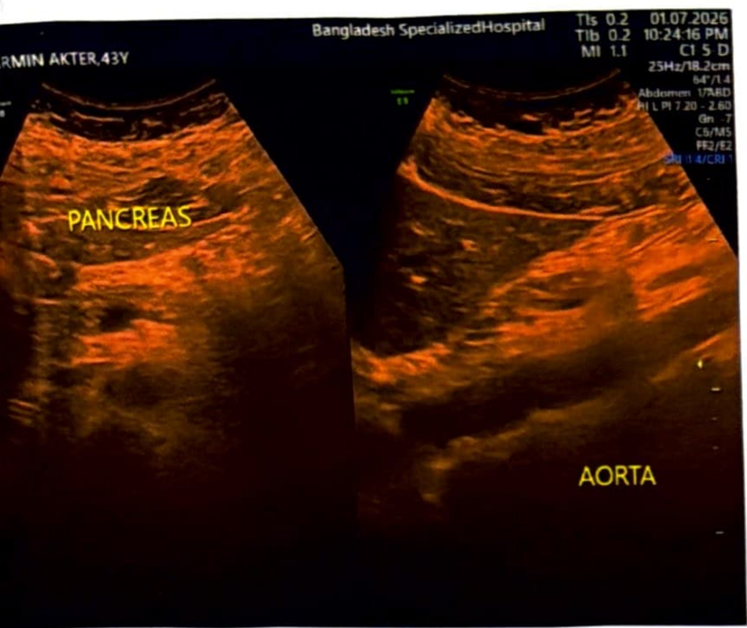

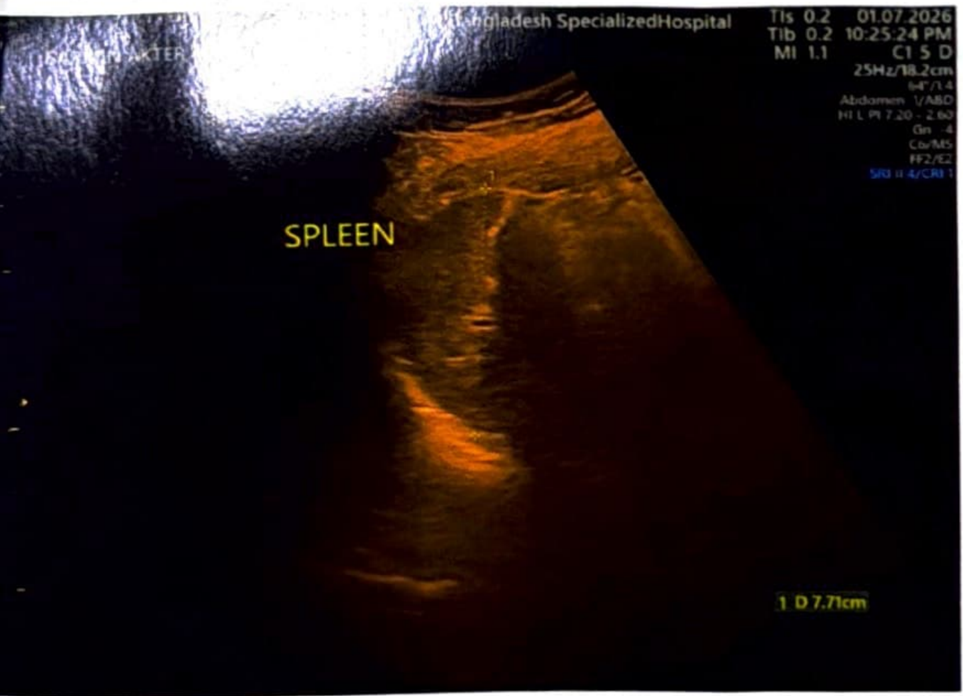

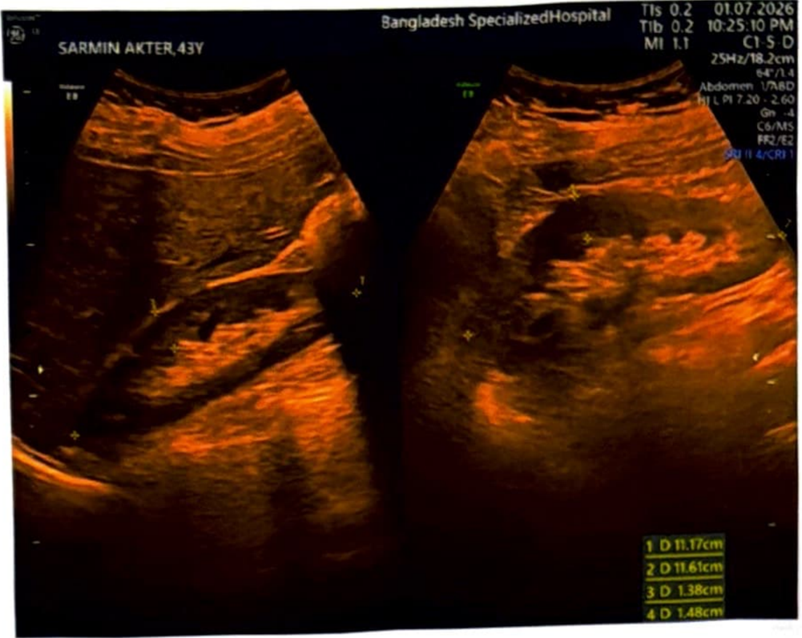

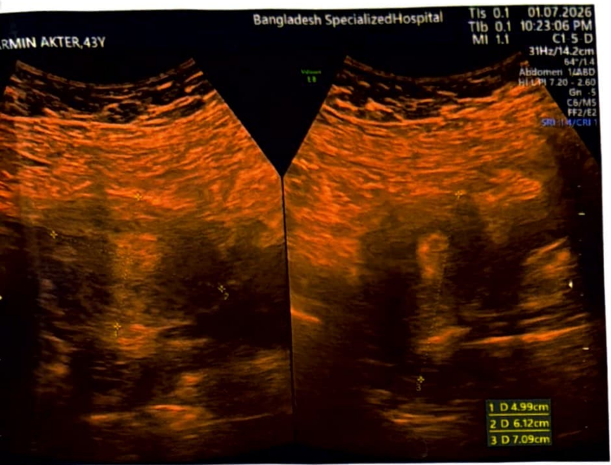

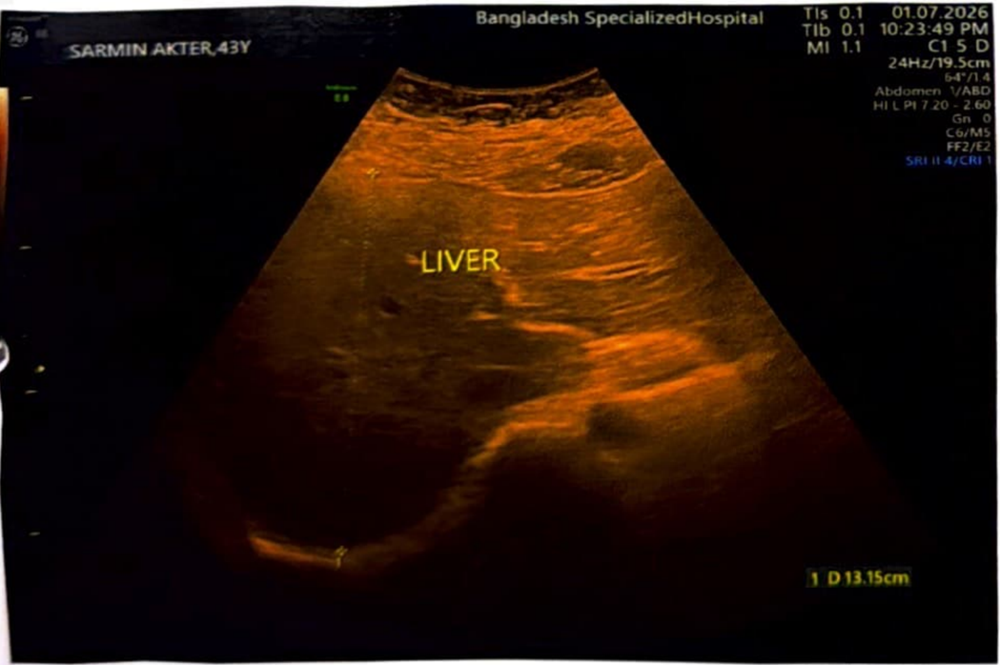

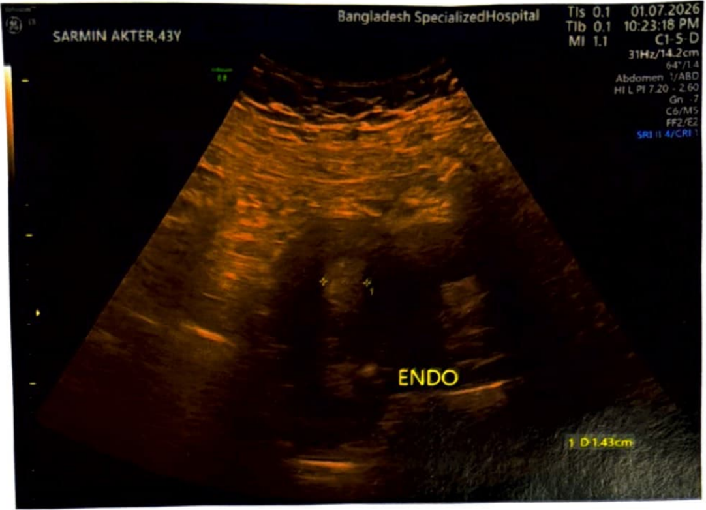

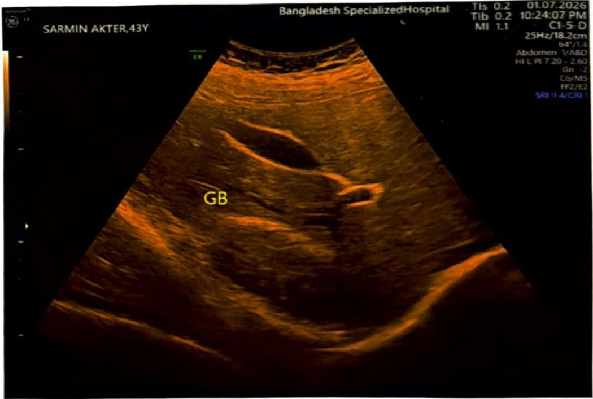

---

## Histopathology 02.07.2026.pdf

BANGLADESH
S  SPECIALIZED HOSPITAL
v:  1111\11111n11111u11111~ 11111  H1sroPArH0LoGv RePoRr  HN:  n1I111111lr1u.1n1rt
Invoice No  :  V 2 607744488
Invoice Date:  01/07/2026 04:57 PM  Delivery Date:  04/07/2026
Hospital No :  H 12 607658470  Report No  :  126000876842
Patient Name  :  MST. SARMIN AKTER  Report Status:  FINALIZED
Age/ Gender  :  43Y 7M 130 / Female
Ref. Doctor  Patient Status:  OPD
: Dr. Ferdous Ara Begum MBBS, OCH, MD (Medical Oncology) , Associate Professor(Rtd)
Sample  : TISSUE
Test Name  Lab No  :  12607925145
: Hlstopathology (1)
Coll. Date  : 02/07/2026 07:20 AM  Rev. Date  :
02/07/2026 07:21 AM  Report Date  :  04/07/2026 05:24 PM
Lab No: H- 3137 /26
Thank  you very  much for  this kind  referral
USG Findings :  Complex solid cystic mass with low suspicious for malignancy at 2-3 O' clock
position In left breast.
Specimen :  Left breast lump at 2-3 O' clock position (Core biopsy).
Gross Findings:
Specimen is received in formalin, labeled with name, number and is designated as wleft breast lump at 2-3 O'clock position". It consists of five unoriented tan-white tissues, largest one measures 1.2 x 0.3 x 0.2cm. All embedded in a block (ax; A 1 ).
Microscopic Features:
Sectjons  made  from  submitted  core  biopsy  show  breast  tissue.  These  sheets,  clusters  and  few  tubules  of anaplastic duct epithelial  cells. These  have enlarged  pleomorphic hyperchromatic nuclei,  some have  prominent nucleoli. Few lymphocytic infiltrations are present.
Occasional mitosis are present. No necrosis is identified.
DCIS and atypical ductal hyperplasia are not seen.
No hemorrhage and calcification are identified.
No lymph-vascular space invasions are present.
In some foci, these reveal lobular like infiltration.
DIAGNOSIS:
Left breast lump at 2-3 O' clock position; Core biopsy:
-Suggestive of lnflltratlng duct cell carcinoma, NST; Grade II. (See description please).
Clinlcopathologlcal, radlo/oglcal  correlatlon and  lmmunohlstochemistry  is recommended  for  further evaluation and confirmation.
N\  N\
Prof. Dr.  Maslw\1 PdrvtU  Prof. Dr.  Maslw\1 PdrvtU
MBBS (0,ll 1 11.ll 1  I  .,:1  ,,lv,.JY)  MBBS (0,ll 1 11.ll 1  I  .,:1  ,,lv,.JY)
St1111,11  \  ""~· ,l  "  St1111,11  \  ""~· ,l  "  l  l  .ill,. ,1,1\)1:.l  .ill,. ,1,1\)1:.l
l lq ,111111, 1  .  l lq ,111111, 1  .  ,  ,  ,l  ,l  .JllltY Mel.llCll'll  .JllltY Mel.llCll'll
HJ11~  HJ11~  1  1  1.i,1.,,1,  .,, ,,,  ,.111 .  .iJ  1.i,1.,,1,  .,, ,,,  ,.111 .  .iJ  Hospltol PLC  Hospltol PLC
Printed by RAFIQUL.,6818 P1l11t.od Ot1tu. 04/0m026 17 23 PM  Pi.100  1 of 1  Sotlwt1~ By  Mysof\ Llm1led
BANGLADESH SPECIALIZED HOSPITAL PLC.
21 Shyamo/1, Mlrpur  Road, Dhaka  1207, !Jana/(J(/C!lli, I Im  line. 106]J.  00666700100,  I:  mall: b5l1l.dhaka@g111e11/.co111. Web: www.bdspecializedhospital.com

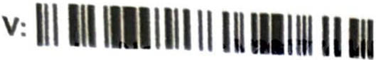

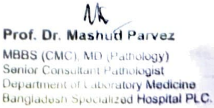

---

## CT chest including Liver 06.07.2026.pdf

BANGLADESH
SPECIALIZED HOSPITAL
het:au,;r }'"" are ,;pecia/
.
C1inica1  Information  Left breast lump.
H/0  previous surgery  None.
Technique  Volume  axia1  scan of Chest with liver  was done.
Contrast  study  Pre  and  post.
Comparison  None.
CT SCAN  OF CHEST INCLUDING  LIVER
. Impression  and  recommendations:
CT  scan  suggests:
Q Hi.gh1y suspicious  ma1ignant  lesion (27 x 19) mm at  upper  and  outer quadrant  of  1eft breast.  No  chest  wall  invasion  is  noted.
Q Normal.  both  l.ungs.
~ No  mediasti.na1  or  axil1ary  lymphadenopathy.
c::;> No  focal  l.esi.on  in  liver.
DR. SHARMIN  AKHTAR  RUPA  ~
i-:lfjBS, M. Phil, Fr"PS Pro!e53or ,,adJology (,, Jrrw9Jn9 Popul~r  MndicaJ Colleg~ & HOBpJld]
Consultant-Bangladeah  Specialized Hospital  Tran,crLptiild  by:  R.l.~v~
llAIJGI AIJFSII SPECIALIZED HOSPITAL  PLC.
llShyomoll, Mlrpur  Road, Dhoko-1207, Ban{)JOdtJsh, J  l01//1111: /06.JJ, OIMo87tJtntJa  1:-mr1II: bJhl.dhokor;J>Qmal/.Ct)m  .. W-~b: www.bd1peclallndhosp/taLcom

---

## immunohistochemistry 13.07.2026.pdf

BANGLADESH
S  SPECIALIZED HOSPITAL
V: 11111111111 ll llllllll  H 1111  lmmunohlstochemlstry Report  HN: 1111 ■11~r11■1r rr'
Invoice No  : V2607745318
Hospital No  Invoice Date:  02/07/2026 03:26 PM
: H12607658470  Report No  : 126000891993  Delivery Date : 12/07/2026
Patient Name  :  MST. SARMIN AKTER  Report Status: FINALIZED
Age/ Gender  : 43Y 7M 22D / Female
Ref. Doctor
Patient Status: OPD : Dr. Ferdous Ara Begum MBBS, OCH, MD (Medlcal Oncology) , Associate Professor(Rtd)
Sample  : TISSUE
Test Name  : lmmunohistochemlstry-4  Lab No  : 12607943167
Coll. Date  : 13107/2026 07:47 PM
Report Date  : 13/07/2026 08:18 PM
Lab No: H- 3137/26
Thank  you ve,y  much for  this kind  refen-al
Specimen
Previous diagnosis  : Left breast lump at  2-3 O'clock  position (Core biopsy).
: Suggestive of infiltrating duct cell carcinoma, NST; Grade II.
Estrogen Receptor (Dako pharmDx)
Progesterone  : None of  the tumor cell nuclel are reactive for ER. Score: (0+0)/8
HER2neu{Dako Hercep test)  Receptor (Dako phannDx) : None of  the tumor cell nuclei are reactive for PR. Score: (0+0)/8
: No staining ls observed or membrane staining is seen.
Conclusion :  ER -  Negative, score 0/8
PR -  Negative, score 0/8
HER2neu -  Negative, score 0
Ki-67  -75% proliferative Index
The specimen was fixed in formalin for 6-48 hours.
Note: Paraffin sections of the formalin  fixed tissues are stained for Estrogen receptor using DAKO Rl5084, Progesterone DAKO R15084, HER2neu RA0485. For estrogen and progesterone receptor study, a result is considered positive if  at least 1% of  the lesional cells display any intensity of  unequivocal nuclear staining. Allred Scoring System for ER & PR -
Score for proportion staining
Prln\tld by MASUl'A2A1 Pni,l.t,d D11w 1310/1'.2026 20 16 PM  Pooo 1 of  2  sonwu,;iy :: Mv-,ft Umllad
BANGLADESH SPECIALIZED HOSPITAL PLC. , 11 co,r Wc1b· www bdspeclal/z.:dhosplrotcom 21 Shyomoll, Mlrpur Road, DhakaI 207, {JallfJIOdesh, /101/111e: l0633,09666100100.  E·1tl(I//  bs/l/,c/11<1I.C1@9m 1 ' ~ · ·

BANGLADESH
S  SPECIALIZED HOSPITAL
\/:  n\ 1\1 \111\1\I \\  1\\1111\1 \\  I 1\1 lmmunohlstochemlstry Report  HN: 111111111mirfll\lll(f ffllr'
\nvoice No :  V2607745318  Invoice Date:  02/07/2026 03:26 PM
Hospital No :  Delivery Date:  12/07/2026
H12607658470  Report No  : 126000891993
Patient Name :  Report Status:  FINALIZED
MST. SARMIN AKTER
~el  Gender :  43Y 7M 120 I Female
Ref. Doctor  Patient Status:  OPD
: Dr. Ferdous Ara Begum MBBS, OCH, MD (Medical Oncology), Associate Professor(Rtd)
Samp\e  : TISSUE
Test Name  Lab No  : 12607943167
: lmmunohlstochemlstry-4
Coll. Date  : 13/07/2026 07:47 PM
Report Date  : 13/07/2026 08:18 PM
For HER2 0 ea' following guideline is employed.
lmmunohistochemistry  is  perfonned  by  automation using VENTANA BenchMark GX  system.
'  '  ~  ~
Prof. Or. M•  Prof. Or. M•
MBBS(CMC~
Pllrud ~ MMUMZ41 Pltr"9d 0.:  11'07,_.  I0:11 PM
IAllllADl$11 SPI 21 Shyamoll, Mlrpur Road. Ohaka-J20l, 1ang,-.,,_  Hodfnl: f OQ,\

